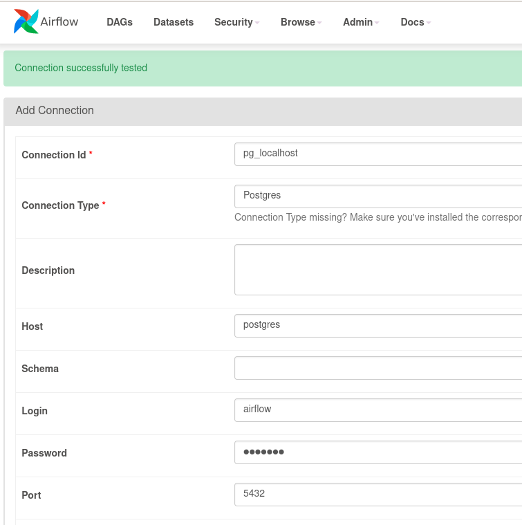

# ETL test solution
***
## Architecture and stack
- Airflow 2.6.3
- Python 3.10
### Допущения
1) Считаем что у нас чистые данные (нет проверок на неправильные типы в файле и т.п.)
2) Считаем что файл не большой и грузим его целиком без разбивки на пакеты (execute_batch)
3) Считаем что у нас 1 файл и он будет обновляться (можно было бы сканировать папку на наличие новых файлов)
4) Скорее всего будут дополнительные отчёты поэтому грузим всю таблицу в БД
5) Считаем что данные будут запрашиваться не часто, оставляем для ОТЧЁТА запрос к сырым данным (не создаём доп. таблицу)
6) Чтоб не усложнять (test) не создаём дополнительный контейнер с БД используем уже имеющийся у Airflow
***
## How to run:
1) `echo -e "AIRFLOW_UID=$(id -u)" > .env`
2) `make etl-init`
3) `make etl-start`
4) Airflow доступен по ссылке http://127.0.0.1:8180/
5) Логин `airflow` пароль `airflow`
6) Создать соединение с типом: `Postgres` имя: `pg_localhost` 
7) Запустить `Postgres_initial_dag_v1`
8) Запустить `Handle_overdue_dag_v1`
Бот доступен по ссылке https://t.me/ETL_test_report_bot
***
#### How to up Airflow in Docker locally
https://airflow.apache.org/docs/apache-airflow/stable/howto/docker-compose/index.html